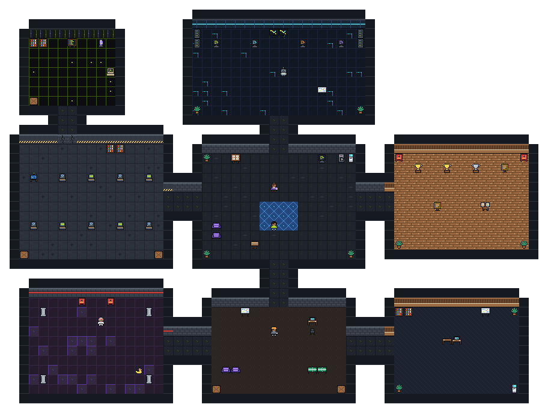

# Shashi Bhushan Vijay — portfolio

My portfolio site: case studies, research, writing and videos, with an admin for publishing them — plus **SHASHI.EXE**, an optional RPG version of the
portfolio at `/play` that never costs the main site a byte it doesn't need.

- **Stack:** Next.js 16 (App Router, Turbopack) · React 19 · TypeScript · Tailwind CSS v4 ·
  Postgres (Neon) via Prisma · three.js (hero) · Phaser 3 (game) · Vercel
- **Content:** projects, articles, milestones and videos live in Postgres and are edited at
  `/admin`; static profile copy is in `src/lib/content.ts` and `src/lib/constants.ts`.

## Local development

```bash
cp .env.example .env    # DATABASE_URL at minimum; the rest enables admin, uploads, mail, chat
npm install
npm run dev             # http://localhost:3000
```

| Script | What it does |
|---|---|
| `npm run dev` / `build` / `start` | Next.js |
| `npm run lint` | ESLint, including the game's bundle-boundary rules |
| `npm run game:assets` | Regenerates the game's pixel art and sounds into `public/game/` (add `-- --preview` for enlarged contact sheets) |
| `npm run db:push` / `seed` | Prisma schema and seed data |

Case studies are written in the admin at `/admin/work`; articles at `/admin`, videos at `/admin/videos`.

---

## SHASHI.EXE — the portfolio as a small RPG



Walk Shashi around eight rooms. Every project, number and trophy in the game is real and also on the
regular site — the game is a different way in, not different content.

| Room | What's there |
|---|---|
| **Central Hub** | The Recruiter (quests), a quest board, a Recruiter-mode kiosk, a coffee machine |
| **AI Lab** | Four terminals — LLM, RAG, OCR, ML — each explaining an idea and linking to the projects that use it |
| **Project Garage** | One machine per project: problem, solution, architecture, stack, what I built, results, links. The indoor-positioning machine runs a live locate-and-route demo (A* on a floor plan) |
| **Trophy Room** | The published patent application, the ARC Hackathon win, Convolve 4.0, ISTE sponsorships, research results, certifications |
| **DSA Arena** | Five multiple-choice problems with complexity and explanations; 3/5 to pass |
| **Startup Garage** | ₹10,00,000, twelve months: pick a product, price, channel and team, and watch a (toy) year play out |
| **Interview Room** | Four interview questions, then the final boss: **THE RECRUITER**, 100 HP, three lives |
| **Secret Developer Room** | Behind a cracked wall. What I'm learning, and an old terminal (`sudo hire shashi`) |

**Systems:** five quests, XP and levels, seven achievements, five Easter eggs, progress saved to
`localStorage` (`shashi-rpg-save-v1`, validated field by field — a corrupt save resets instead of
crashing), sound via Howler (off by default, `M` to toggle), tap-to-move on touch screens.

**For recruiters in a hurry:** *Recruiter mode* — on the boot screen, the kiosk, and the pause menu —
is the whole profile on one card. Nobody has to play a game to find the résumé.

**Controls:** `WASD`/arrows to move (or tap), `E`/`Space` to interact (or tap the thing), `Q` quests,
`Esc` pause, `M` sound.

### The engineering story: a game that costs the portfolio nothing

The constraint was that `/` must not load Phaser, game assets, game audio, game CSS, or game code —
not even in the background.

```
/            Server-rendered portfolio. No game imports (enforced by ESLint).
 └─ <Link href="/play" prefetch={false}>          nothing from /play is fetched until clicked
/play        page.tsx — server component, metadata, published case-study slugs
 └─ game-loader.tsx    next/dynamic(ssr: false); the boot screen is the server-rendered fallback
     └─ game-shell.tsx    boot sequence, HUD, overlays, store          13 KB gzip, lazy
         └─ phaser-game.tsx   import('engine/create-game') on mount
             └─ Phaser + scenes                                         321 KB gzip, lazy
                 └─ /game/*.png (4 KB) · /game/audio/*.wav (377 KB, only once sound is on)
```

**Measured** (production build, assets referenced by each page's initial HTML):

| | `main` before the game | with the game |
|---|---|---|
| `/` JavaScript | 287.8 KB gzip | 288.2 KB gzip (+0.4 KB: the Play link and command-palette entry) |
| `/` CSS | 74,567 B | 74,630 B (+63 B) |
| `/` Phaser, game chunks, game assets, canvas | — | none |
| `/play` before pressing Enter | — | 209.8 KB JS gzip, boot screen server-rendered |

**Guardrails** — `eslint.config.mjs` fails the build if:

- anything outside `src/game` and `src/app/play` imports `phaser` or `@/game/*`;
- the game's React layer statically imports Phaser, the engine, scenes or entities (only a dynamic
  `import()` is allowed);
- the game imports `motion/react` (see below).

**Lessons learned** while building it — each one was caught by measuring or testing, not by reading the code:

1. **Sharing a library with a lazy route can still tax the home page.** The game first used `motion`
   for panel animations. Nothing from the game reached `/`, yet `/` grew by 4.6 KB gzip: with two
   routes importing different parts of `motion`, Turbopack could no longer merge it into one module
   and shipped it to the home page as many smaller ones. The game now animates with the Web Animations
   API (`src/game/ui/use-appear.ts`), and a lint rule keeps it that way.
2. **Tailwind builds one stylesheet from every source file.** The game's utilities added ~1 KB gzip of
   render-blocking CSS to every page. Now `globals.css` skips `src/game` (`@source not`), and the game
   ships its own `src/game/game.css`, imported only by `/play`. Shared tokens moved to
   `src/app/tokens.css` so both sheets use the same design system.
3. **WebGL can't render into a 0×0 box.** Phaser created in a zero-size container (a hidden tab or
   panel) threw inside an image `onload` — invisible to React — and the boot screen hung. The engine now
   waits for a real size (ResizeObserver), and a watchdog shows the "couldn't start" screen if the
   renderer never reports in.
4. **Phaser reads the keyboard a frame late.** The `E` that closed a dialogue was processed by the
   world on the next frame and re-opened it. Key events older than the last panel close are ignored.
5. **One broken panel shouldn't end the game.** Panels sit inside their own error boundary: a failing
   one closes with a notice and the world keeps running.

### Code map

```
src/app/play/            route: page (metadata, published slugs) and error boundary
src/game/
  game-loader.tsx        dynamic import of the shell; server-rendered boot screen
  game-shell.tsx         boot → world, HUD, global keys (Esc, M, Q, Konami)
  phaser-game.tsx        engine lifecycle: lazy import, size wait, watchdog, teardown
  engine/                Phaser config and the React ↔ Phaser contract (types.ts is Phaser-free)
  scenes/                boot (generated textures), preload (sprites), world (map, input, camera)
  entities/              player (movement, paths, animation), NPCs
  systems/               Phaser-free logic: world builder, A*, progression, save, audio, events
  store/game-store.ts    zustand store shared by Phaser and React; all progress flows through commit()
  data/                  everything the game says: map, projects, AI Lab, trophies, questions, dialogue
  ui/                    panels and HUD (Tailwind, own stylesheet)
scripts/build-game-assets.ts   pixel art (tileset, characters, UI) and the README map render
scripts/build-game-audio.ts    synthesized sound effects and music loops
```

Content is data, not scene code: to change what a machine or terminal says, edit `src/game/data/`.
The game links to a case study only when it is published (the `/play` page passes the published
slugs), so drafts never produce dead links.

**Assets:** every sprite and sound is generated by the two scripts above — no third-party art or
audio to license. The whole tileset is 2.7 KB.

**Analytics:** anonymous events through the site's Vercel Analytics (`src/game/analytics.ts`):
`game_started`, `project_opened`, `dsa_completed`, `game_completed`, `recruiter_mode_opened`,
`easter_egg_found` and a few more. No identifiers, no free text.

**Accessibility:** fully keyboard-playable; panels are focus-trapped dialogs that return focus;
dialogue is announced to screen readers in full rather than letter by letter; a Motion setting
(follow system / reduced / full) turns off camera smoothing, shake, particles, typewriter text and
animations; sound is off by default and toggleable; on touch screens the interact prompt becomes a
button.

**Debugging:** in development only, `window.__SHASHI_GAME__` (the Phaser game) and
`window.__SHASHI_STORE__` (the store) are exposed. `__SHASHI_GAME__.step(time, delta)` advances
frames manually, which is how the game was play-tested end to end even in a hidden browser tab.
